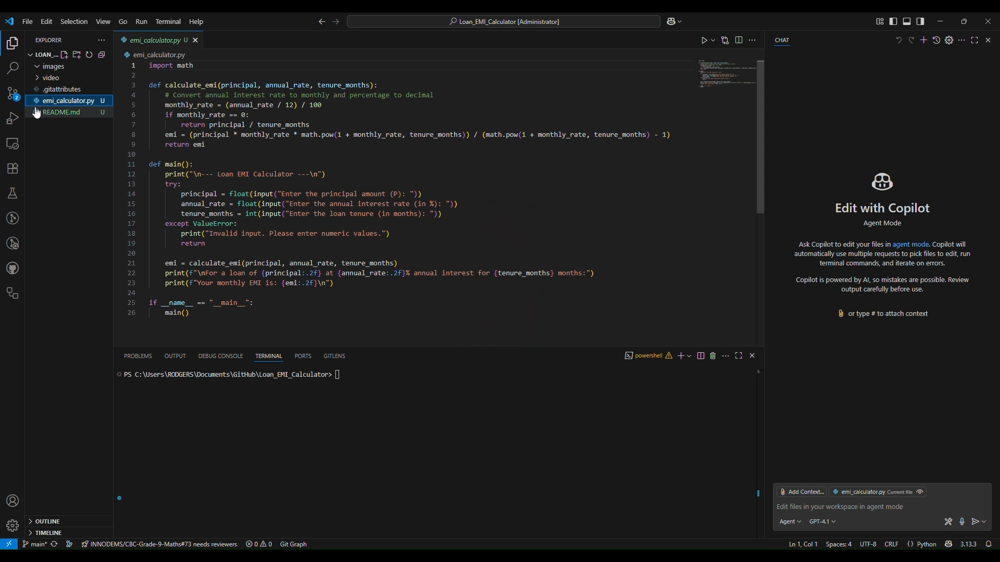
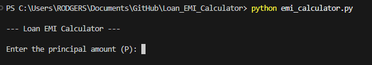
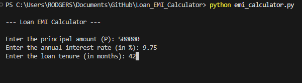
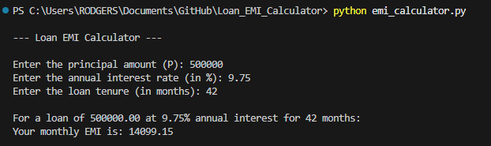

# Loan EMI Calculator

## Objective
This project provides a simple interactive Python program to calculate the monthly EMI (Equated Monthly Instalment) for a loan, based on user input for principal, interest rate, and loan tenure.

## EMI Formula
The EMI is calculated using the following formula:

\[
EMI = \frac{P \cdot R \cdot (1 + R)^N}{(1 + R)^N - 1}
\]

Where:
- **P**: Principal loan amount
- **R**: Monthly interest rate (annual rate divided by 12 and converted to decimal)
- **N**: Number of monthly instalments (loan tenure in months)

## How to Use

1. **Ensure you have Python installed** (version 3.x recommended).
2. **Open a terminal or command prompt.**
3. **Navigate to the project directory:**
   ```sh
   cd Loan_EMI_Calculator
   ```
4. **Run the script:**
   ```sh
   python emi_calculator.py
   ```
   If you have multiple versions of Python, you may need to use `python3` instead of `python`.
5. **Follow the prompts** to enter:
   - Principal amount
   - Annual interest rate (in %)
   - Loan tenure (in months)
6. **View your calculated EMI** displayed in a clear format.

## Example
```
--- Loan EMI Calculator ---

Enter the principal amount (P): 500000
Enter the annual interest rate (in %): 8.5
Enter the loan tenure (in months): 60

For a loan of 500000.00 at 8.50% annual interest for 60 months:
Your monthly EMI is: 10257.94
```

## Demo Video & Images

### Demo Video

[](video/Loan_EMI%20-%20Made%20with%20Clipchamp.mp4)

### Images
- _Add screenshots of the program running. Place your images in the `Loan_EMI_Calculator` directory and update the links below._







## Notes
- The program handles zero interest rates as a special case (simple division).
- Input validation is included for numeric values.

## License
This project is open source and free to use. 